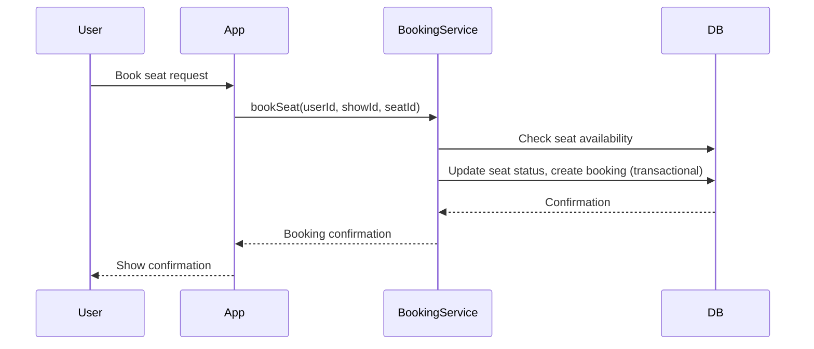

# 📦 BookMyShow Clone — Low-Level Design (LLD)

## 1. Entities & Database Schema
| Entity | Fields |
|--------|---------|
| User | user_id (PK), name, email (unique), password_hash, created_at |
| Movie | movie_id (PK), title, language, genre, duration |
| Theater | theater_id (PK), name, city |
| Show | show_id (PK), movie_id (FK), theater_id (FK), show_time, screen_no |
| Seat | seat_id (PK), show_id (FK), seat_number, status (AVAILABLE, BOOKED) |
| Booking | booking_id (PK), user_id (FK), show_id (FK), seat_id (FK), status (CONFIRMED, CANCELLED), booking_time |

PK: Primary Key, FK: Foreign Key  
JPA annotations enforce PKs, FKs, and unique constraints in code.

---

## 2. API Contracts
| Method | Endpoint | Description |
|--------|-----------|-------------|
| POST | /users/register | Create account |
| POST | /users/login | Authenticate user |
| GET | /movies?city=xyz | List movies by city |
| GET | /shows?movieId=123&theaterId=456 | List showtimes |
| GET | /shows/{id}/seats | View available seats |
| POST | /bookings | Book selected seats |

---

## 3. Sequence Diagram — Seat Booking


---

## 4. Concurrency Handling
Prevent double booking:  
Use JPA `@Transactional` in BookingService to ensure atomicity.  
Check seat status before booking; update status in the same transaction.  
(Optional) Add a unique constraint on `(show_id, seat_number, status=BOOKED)` at the DB level.  
Why: Ensures two users cannot book the same seat at the same time.

---

## 5. Implementation Details
Spring Boot project with Gradle build.  
JPA Repositories for all entities (User, Movie, Theater, Show, Seat, Booking).  
Controllers expose REST APIs as per contracts.  
Service Layer contains business logic and transaction management.  
Password Security: BCrypt hashing for user passwords.  
Sample Data: Provided via `import.sql`.  
Payment: Mocked, always returns success.

---

## 6. Example Entity (User)
```java
@Entity
@Table(name = "users")
public class User {
    @Id
    @GeneratedValue(strategy = GenerationType.IDENTITY)
    private Long userId;
    private String name;
    @Column(unique = true)
    private String email;
    private String passwordHash;
    private LocalDateTime createdAt;
    // getters and setters
}
```

---

## 7. Example API Request/Response
**Register User**

**Request:**
```http
POST /users/register
{
  "name": "Shriraj",
  "email": "shriraj@example.com",
  "password": "password123"
}
```

**Response:**
```json
{
  "userId": 1,
  "name": "Shriraj",
  "email": "shriraj@example.com",
  "createdAt": "2025-11-06T12:00:00"
}
```

---

## 8. Error Handling
Returns appropriate HTTP status codes (e.g., 400 for bad request, 401 for unauthorized, 409 for conflict).  
Error messages are descriptive for client troubleshooting.

---


## 9. References
Spring Boot Documentation  
Spring Data JPA  
BCrypt
